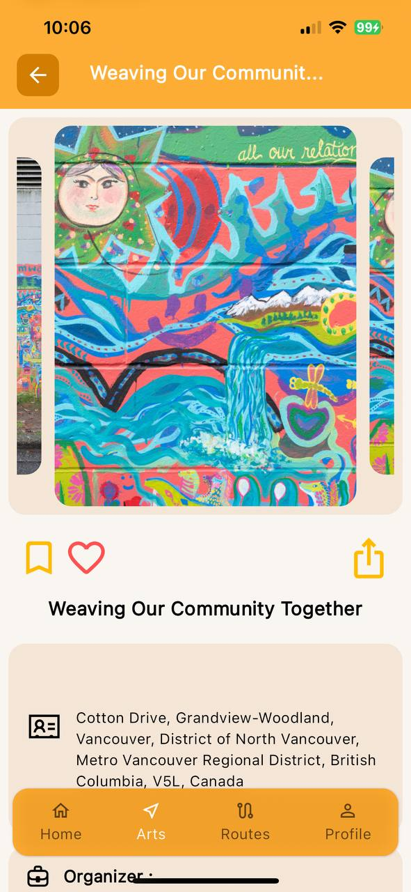
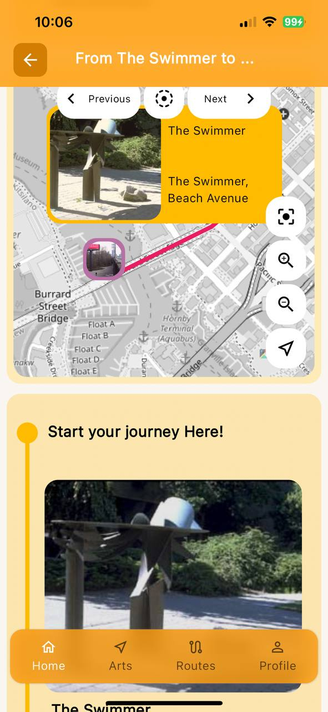
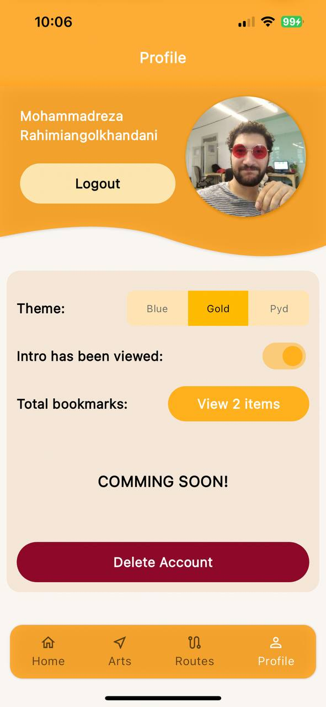
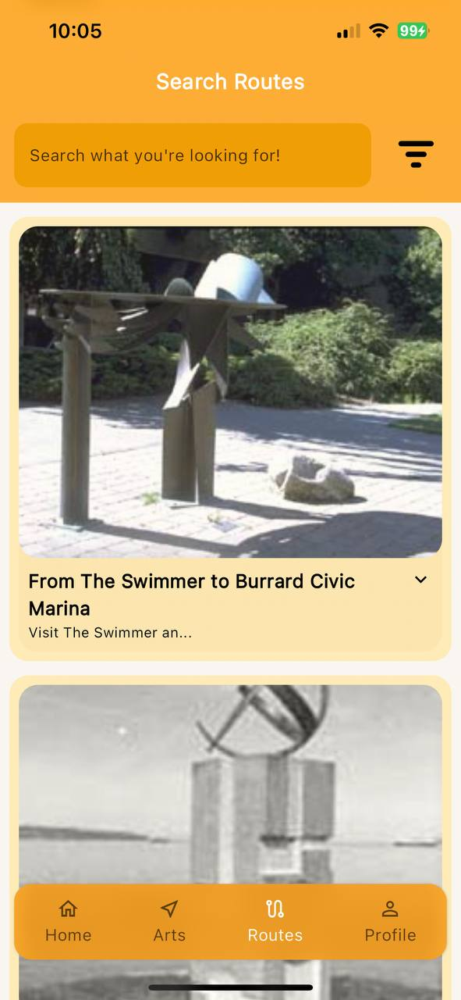
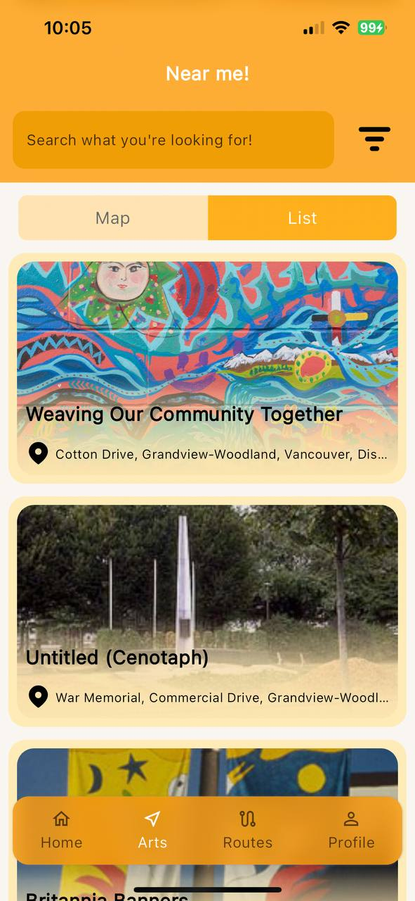
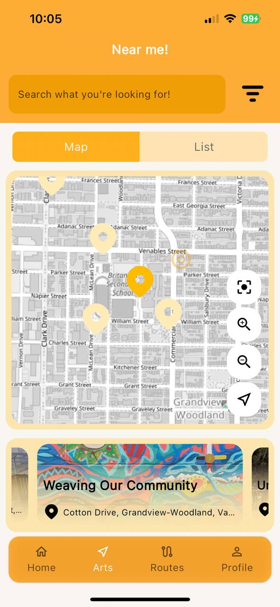
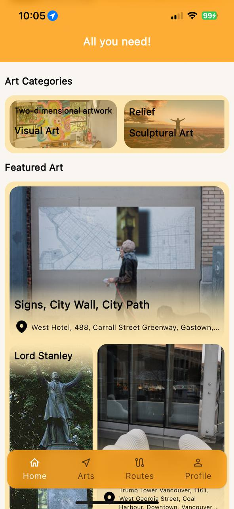

# Art Wise City Guide

This is an under-development project - don't judge the book by its cover :D

## Getting Started

This is a project for technical learning use only - it uses open source data/map/modules to be a showcase and tour guide based on where you live

      

## License

Do not copy/fork/download the code for commercial use
if you want to learn flutter feel free to do so
contact me if you are interested in buying the project for commercial use
